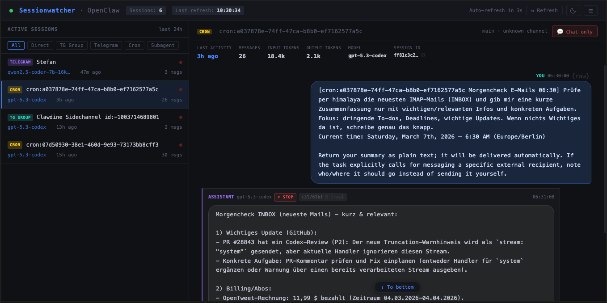
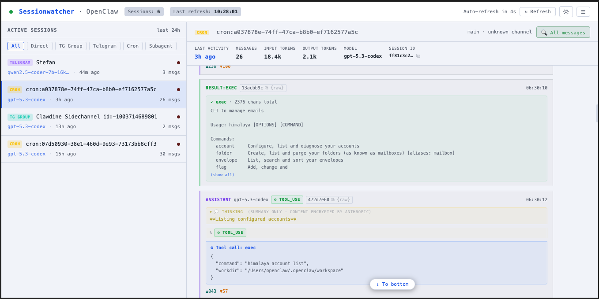

# OpenClaw Session Watcher / Dashboard


A lightweight local agent session monitor for watching live OpenClaw sessions in real time.

<br clear="right" />

 

---

### What it does


OpenClaw Session Watcher reads the JSONL session logs written by OpenClaw agents and presents them as a live, auto-refreshing web UI. It gives you a bird's-eye view of all active and recent sessions, and lets you drill into individual conversations to inspect messages, tool calls, thinking blocks, and more — without having to tail log files manually.

  
Dark mode is the default. An optional light mode is available for brighter environments:  
  

**Features:**

- Built-in light mode and dark mode for the full UI
- Session list with status indicators (active / stopped / stale / processing)
- Top bar branding: `OpenClaw Session Watcher` + live green status dot
- Subtle footer meta line with session count and last refresh time
- **Full qualified model names** with provider in session list and message headers (e.g., `openai/gpt-4-turbo`)
- **Gateway message distinction**: Gateway-injected messages labeled clearly as "gateway" without model attribution
- **Enhanced Cron sessions**: Shortened cron ID (with copy button), next run countdown, and last run status/duration
- **ACP (Subagent) Sessions**: Real-time monitoring of autonomous agent runs with status indicators, processing animations, and acpx backend message loading
- **Processing Indicators**: Green pulsing dot and typing animation when agents are actively working
- Per-session message stream with structured rendering:
  - WhatsApp-style chat bubbles — user messages right-aligned, assistant left-aligned
  - Dedicated right-aligned **Inter-session cards** for `provenance.kind=inter_session` payloads (not rendered as normal user chat bubbles)
  - Inter-session preview mode: starts after `<<<BEGIN_UNTRUSTED_CHILD_RESULT>>>` when present, compact default snippet, inline **(show all)** in the text panel
  - User & assistant text messages (with `\n` → line break support)
  - Grouped **system-entry bubbles** for non-text assistant/internal records, so headers, thinking, tool calls, tool results, and token stats stay visually connected
  - Smooth entry transitions in the selected session: newly arriving entries fade in quickly, and changed entries (text/tool/event updates) get a brief highlight pulse
  - Thinking blocks (individually collapsible; notice shown when Anthropic encrypts content)
  - ⚙ Tool calls with arguments (truncated at 300 chars with inline **show all**)
  - ✓/✗ Tool results with trimmed preview + **(show all)** — fetched on demand, persists across auto-refresh
  - ⚡ Session event markers (`thinking`, model changes, prompt errors, session/custom/meta fallbacks)
- **Chat-only toggle** — hides thinking/tool blocks instantly; button color reflects current state (green = all messages, red = chat only)
- Optional chat input for sending messages to the selected session via OpenClaw Gateway
  - Idempotency key per send to reduce accidental duplicates
  - Backend duplicate-ACK window for quick double-submits
  - Automatic gateway reconnect when WebSocket drops
  - Inline send status rendered above the input (no layout jump)
- User source detection for inbound user bubbles (`Direct` vs `Telegram`) with distinct labels/colors
- Full message history — entire session loaded, no truncation cap
- Raw JSON modal for every message
- Copy button for session/message IDs
- Unread indicator (orange dot) for sessions with new messages
- Smart scroll — stays at bottom during live updates, preserves position otherwise
- **Live push updates** via Server-Sent Events (SSE) — selected session updates typically <1s after new log entries
  - Adaptive polling fallback (500ms → 1s → 2s → 4s → 8s → 10s) if SSE unavailable or disconnected
  - Session list refreshes every 10 seconds in the background
  - Update source indicator: `↻` for periodic refresh, `•` for live push
- **Burger menu** (top right) — About dialog + Report an Issue (opens GitHub issue template chooser)
- Zero external dependencies — pure Python stdlib + vanilla JS
  - Optional: `websocket-client` enables gateway chat send features (must be installed in the same Python interpreter used to run `server.py`)

---

## Release 1.2 Highlights

- Added gateway-backed chat send endpoint and UI (`POST /api/chat/send`)
- Added resilient gateway connection handling (auto-reconnect + lazy reconnect on send)
- Fixed duplicate user-message rendering caused by retry/fallback append behavior
- Improved session-type stability so Telegram sessions stay Telegram even after transient webchat metadata
- Added gateway timestamp-prefix cleanup for user text rendering
- Added user-source classification (`direct`/`telegram`) for differentiated bubble styling
- Added event rendering for `session`, `custom:model-snapshot`, and unknown entry fallbacks (instead of silent drops)
- Improved assistant error visibility when assistant content is empty
- Switched UI activity age to last visible JSONL entry timestamp before metadata fallback

## Release 1.3 Highlights

- Added lenient `openclaw.json` parsing for gateway/cron config reads, so trailing commas no longer break Session Watcher startup/runtime reads.
- Added alias-aware session JSONL resolution and merge logic for metadata drift cases (`sessionId` points to a new file while `sessionFile` still points to an older file).
- Updated session list loading, session detail loading, SSE change detection, and full-entry lookup to use the same merged multi-path resolver.
- Improved `show all` failure feedback in the UI by surfacing backend error text instead of a generic `(error)` label.
- Added explicit message provenance fields from backend parsing (`provenance_kind`, `provenance_source_session_key`, `provenance_source_channel`, `provenance_source_tool`) for robust frontend rendering decisions.
- Filtered delivery-mirror traffic from model-label rendering to reduce noisy model switches in the timeline.
- Hardened session rollover and gateway recovery paths to keep live updates stable across transport/file churn.
- Improved Telegram group label extraction from metadata for cleaner, more reliable session list naming.
- Simplified startup and LaunchAgent install flow in `start.sh` / `launchctl.sh` for more predictable local operation.
- Added dedicated Inter-session rendering path in the UI:
  - stays right-aligned (input side) but uses a non-bubble card style
  - shows source session/channel/tool metadata in-header
  - includes message ID copy + raw JSON actions like other message types
  - truncates long payloads with inline **(show all)** expansion

## Release 1.4 Highlights

- **Full qualified model names**: Display now shows full qualified model names with provider (e.g., `openai/gpt-4-turbo`, `anthropic/claude-opus-4`) instead of just the model name. Backend extracts provider from message metadata and displays in session list and message headers when available.
- **Gateway message handling**: `gateway-injected` metadata is no longer misrepresented as a model name. Gateway-injected messages now display as "gateway" in the role label with no model attribution, providing clearer visibility into message routing.
- **Session count accuracy**: Fixed footer session count to match displayed session list (filtered to sessions with messages or currently selected).
- **Enhanced cron session display**:
  - Cron job IDs shown shortened (first 8 chars) with copy button in session list, matching message ID display style
  - Next scheduled run time displayed as countdown format (`2h`, `30m`, `45s`)
  - Last run status and duration shown inline (e.g., `◆ success 2.5s`)
  - Metadata sourced from `jobs.json` state tracking for real-time visibility into cron execution
- **CSS refinements**: Increased model name display width (140px → 250px) and character truncation (22 → 100 chars) to accommodate longer qualified names.

## Release 1.5 Highlights

- **ACP (Autonomous Code Pragma) Session Support**:
  - New "ACP" session type with magenta badge for subagent spawns
  - Displays ACP subagent activity in session list with unique status indicator
  - Messages loaded from acpx backend (`.acpx/sessions/{id}.json`) when JSONL unavailable
  - Support for both User and Agent message types from acpx format

- **Live Processing Indicators**:
  - Green pulsing status dot for active agent processing (detected via lock files)
  - Typing animation in chat window when OpenClaw is working (`✏️ OpenClaw is processing…`)
  - Distinguishes between idle, active, and stopped sessions at a glance

- **ACP Status Header**:
  - For ACP sessions, replaces standard stats with live ACP-specific panel
  - Shows: Status (🟢 Running / 🛑 Closed / ⏸ Idle), Last Activity countdown, Input Tokens, Session ID
  - Real-time polling ensures visibility into long-running autonomous tasks

- **Unified Telegram Filter**:
  - Combined "TG Group" and "Telegram" filters into single "Telegram" toggle
  - Shows both direct messages and group conversations under one filter

- **ACP Messages Display**:
  - Thinking blocks (💭) with truncated previews for assistant thinking
  - Tool calls and results from acpx session streams
  - Support for multipart Agent content with thinking/text/tool-use mixing

- **Enhanced Session Detection**:
  - Automatically identifies ACP sessions from `acp` metadata in sessions.json
  - Maps OpenClaw session IDs to acpx runtime IDs for cross-system correlation
  - Handles ACP "pending" identity states during agent startup

## Release 1.6 Highlights

- **Cron next-run display stability**:
  - Cron cards now show `Next: Running...` while a cron session is actively processing
  - Past-due next-run timestamps no longer oscillate between `Running...` and `0s`
  - Forced refresh for due cron entries is now time-bounded to avoid endless refresh loops

- **Provider error context in assistant bubbles**:
  - Empty assistant error turns now render a structured provider-error panel
  - Shows the provider error text when available (for example `Provider returned error`)
  - Adds immediate context by listing the last preceding tool call(s) and argument hints

- **Voice message rendering for Telegram/media payloads**:
  - User messages containing audio media markers now render as a dedicated voice-message bubble
  - Includes compact play glyph + waveform visualization and optional cleaned caption text
  - Removes noisy metadata/media envelope text from the primary bubble content

- **Processing-state consistency refinements**:
  - Session list status dot, cron `Running...` label, and typing indicator now share the same processing-state helper logic
  - Reduces temporary state mismatches between detail view and session list during live updates

## Release 2026.3.13 Highlights

**Requires OpenClaw ≥ 2026.3.12** — the gateway introduced scope-enforcement for clients without a signed device identity. Without a device signature, `clearUnboundScopes()` strips `operator.write` from the connection, causing `chat.send` to fail with `missing scope: operator.write`.

- **Ed25519 Device Identity for Gateway chat** — Session Watcher now authenticates with a cryptographic device identity when connecting to the OpenClaw Gateway:
  - On first start, a permanent Ed25519 key pair is generated at `~/.openclaw/sessionwatcher-device.json`
  - The device is auto-registered in `~/.openclaw/devices/paired.json` with full operator scopes (incl. `operator.write`)
  - The OpenClaw gateway daemon is restarted automatically if the device was newly registered
  - Every connect signs the gateway-issued nonce with the private key (V3 payload); the gateway verifies and grants the declared scopes without clearing them
  - Falls back gracefully to unsigned connects if the `cryptography` package is not available (chat send will be unavailable in that case)

- **New dependency for chat send**: `pip install websocket-client cryptography` — `cryptography` is now required alongside `websocket-client` for gateway chat functionality.

---

## Requirements

- Python 3.9 or newer
- An OpenClaw installation with agents writing sessions to `~/.openclaw/agents/`
- Optional for chat send from the Session Watcher UI: `websocket-client` and `cryptography` in the runtime interpreter

---

## Installation

```bash
# Clone or copy the directory next to your OpenClaw data
git clone https://github.com/EvanDataForge/openclaw-sessionwatcher
cd openclaw-sessionwatcher
```

That's it. No `pip install`, no build step.

If you want to send chat messages from the dashboard UI, install the optional packages:

```bash
./../.venv/bin/python -m pip install websocket-client cryptography
```

If you use a different interpreter for SessionWatcher, install both packages there instead.

### macOS LaunchAgent Setup (optional auto-start)

To run OpenClaw Session Watcher as a macOS LaunchAgent that starts automatically on login:

```bash
./start.sh install
```

This creates a LaunchAgent plist and starts the service. To remove auto-start:

```bash
./start.sh uninstall
```

---

## Usage

### Basic Commands

```bash
./start.sh              # Start the session watcher (default)
./start.sh stop         # Stop the running instance
./start.sh restart      # Stop and start
./start.sh install      # Install as macOS LaunchAgent (auto-start on login)
./start.sh uninstall    # Remove LaunchAgent auto-start
```

Then open **http://127.0.0.1:8090** in your browser.

### Python Options

`start.sh` automatically uses `../.venv/bin/python` if it exists, otherwise `python3`. Override with:

```bash
SESSIONWATCHER_PYTHON=/path/to/python ./start.sh
```

If you need to start the server manually without the wrapper script:

```bash
python3 server.py --port 8090 --bind 127.0.0.1
```

### Options

| Environment variable      | Default       | Description                        |
|---------------------------|---------------|------------------------------------|
| `OPENCLAW_DIR`            | `~/.openclaw` | Path to OpenClaw data directory    |
| `SESSIONWATCHER_PORT`     | `8090`        | HTTP port to listen on             |
| `SESSIONWATCHER_BIND`     | `127.0.0.1`   | Bind address (use `0.0.0.0` for LAN) |
| `SESSIONWATCHER_ACCESS_TOKEN` | _(empty)_ | Required for non-loopback/LAN bind; enables cookie-based access protection |
| `SESSIONWATCHER_PYTHON`   | `../.venv/bin/python` if present, else `python3` | Python executable used by `start.sh` |

Example — expose on LAN safely, with a custom OpenClaw dir:

```bash
OPENCLAW_DIR=/data/openclaw \
SESSIONWATCHER_BIND=0.0.0.0 \
SESSIONWATCHER_PORT=9000 \
SESSIONWATCHER_ACCESS_TOKEN='replace-with-a-long-random-token' \
./start.sh
```

Then open the UI once with:

```text
http://<your-lan-ip>:9000/?access_token=<your-token>
```

That bootstrap URL stores an `HttpOnly` cookie and immediately removes the token from the address bar.

> OpenClaw Session Watcher will refuse to bind to `0.0.0.0`, `::`, or any other non-loopback address unless `SESSIONWATCHER_ACCESS_TOKEN` is set.

### Persistent local configuration

`start.sh` automatically loads the first file that exists from this list:

- `.sessionwatcher.env`
- `.env.local`
- `.env`

This is useful if you want OpenClaw Session Watcher to always start in LAN mode without passing flags manually.

Example:

```bash
cat > .env.local <<'EOF'
SESSIONWATCHER_BIND=0.0.0.0
SESSIONWATCHER_PORT=8090
SESSIONWATCHER_ACCESS_TOKEN=replace-with-a-long-random-token
EOF
```

These files are intended for local machine config and should not be committed.

### LaunchAgent / auto-start on macOS

OpenClaw Session Watcher can run as a macOS `LaunchAgent` so it starts automatically when your user logs in.

Typical properties of the LaunchAgent setup:

- starts on login (`RunAtLoad`)
- restarts automatically if it exits (`KeepAlive`)
- writes logs to `logs/launchd.log`
- can inject `SESSIONWATCHER_BIND`, `SESSIONWATCHER_PORT`, and `SESSIONWATCHER_ACCESS_TOKEN`
- plist location: `~/Library/LaunchAgents/com.openclaw.sessionwatcher.plist`

Control commands via `start.sh`:

```bash
./start.sh install       # Install and start LaunchAgent
./start.sh uninstall     # Remove LaunchAgent auto-start
./start.sh restart       # Restart (works whether running manually or via LaunchAgent)
./start.sh stop          # Stop (works whether running manually or via LaunchAgent)
```

---

## How it works

### Data flow

```
~/.openclaw/agents/*/sessions/
  sessions.json       ← session metadata (label, timestamps, model, …)
  <session-id>.jsonl  ← message log (one JSON object per line; resolver can merge alias files)
          │
          ├─→ (for JSONL-backed sessions)
          │
          ▼

~/.acpx/sessions/
  <acpx-id>.json      ← ACP/acpx session state (for ACP-type sessions)
  <acpx-id>.stream.ndjson ← ACP event stream
          │
          └─→ (for ACP sessions)

          └─┬─────────────────────┘
            │
            ▼
      server.py
  ┌─────────────────────────────┐
  │  load_all_sessions()        │  reads sessions.json + tail of each JSONL
  │  resolve_session_jsonl_paths() │ resolves canonical + alias JSONL paths
  │  find_acp_session_id()      │  maps OpenClaw → acpx session IDs
  │  load_acp_session_messages()│  loads messages from acpx backend
  │  _merge_session_entries()   │ merges/de-dupes entries across alias files
  │  parse_messages()           │  structures raw entries into display records
  │  _tool_result_preview()     │  trims large tool results to 300 chars
  │  _dedupe_retry_user_messages() │ collapses retry duplicate user entries
  │  strip_metadata()           │  removes gateway metadata headers
  │  strip_gateway_time_prefix()│  removes leading [Tue ... GMT+X] prefix
  │  classify_user_source()     │  marks user message source as direct/telegram
  │  strip_markers()            │  removes [[...]] markers from text
  │  load_gateway_config()      │  reads gateway settings from openclaw.json
  │  get_acp_session_info()     │  fetches live ACP status from .acpx
  └────────────┬────────────────┘
               │  JSON API
               ▼
    index.html (single-file frontend)
  ┌─────────────────────────────┐
  │  GET /api/sessions          │  session list with stats + ACP indicators
  │  GET /api/sessions/:id/messages            │  full message stream (JSONL or ACP)
  │  GET /api/sessions/:id/acp-info            │  ACP session live status
  │  GET /api/sessions/:id/events              │  SSE stream for live file change notifications
  │  GET /api/sessions/:id/entry/:eid/full     │  full text of one entry (on demand)
  │  GET /api/config/gateway                   │  gateway availability/config (token redacted)
  │  POST /api/chat/send                       │  send message to selected session key
  │  GET /api/status                           │  health check
  └─────────────────────────────┘
```

### Session list logic

Sessions are loaded from all agents under `$OPENCLAW_DIR/agents/`. Only sessions updated within the last 24 hours are shown (configurable via `ACTIVE_WINDOW_H` in `server.py`). The status dot colour follows this priority:

| Condition | Dot | Behavior |
|---|---|---|
| Processing (lock file exists) | 🟢 Green, fast pulse | Agent actively working |
| Recent (< 10 min) + stopped | 🔴 Red | Session finished, still fresh |
| Recent (< 10 min) + no stop | 🟢 Green, slow pulse | Session active, no explicit stop |
| Older (> 10 min) | 🟤 Dark red | Stale, no recent activity |

ACP sessions display their own status in the detail header (Running/Closed/Idle) with real-time polling of `.acpx/sessions/{id}.json` state.

"Last activity" in the UI is based on the last visible JSONL message timestamp (`last_ts_iso`) when available, and only falls back to `sessions.json.updatedAt` otherwise. For ACP sessions, last activity comes from `last_used_at` field in the acpx backend.

### Message parsing

Each JSONL entry is classified by its `type` field:

| JSONL type | Rendered as |
|---|---|
| `message` (role: user/assistant/toolResult) | Message bubble |
| `thinking_level_change` | ⚡ Event marker |
| `model_change` | ⚡ Event marker |
| `session` | ⚡ Event marker (`session started …`) |
| `custom` (`openclaw:prompt-error`) | ⚡ Event marker (`prompt error …`) |
| `custom` (`model-snapshot`) | ⚡ Event marker (`model snapshot …`) |
| `custom` (other) | ⚡ Event marker (`custom:<type> …`) |
| unknown non-`message` type | ⚡ Event marker (`entry:<type> …`) |

ACP sessions load messages from the acpx backend (`.acpx/sessions/{id}.json`):

| ACP Message type | Rendered as |
|---|---|
| `User` message | User bubble (identical to JSONL format) |
| `Agent` message | Assistant bubble with content blocks |
|   - `Thinking` block | Collapsible thinking block with `💭` prefix |
|   - `Text` block | Normal text content |
|   - `ToolUse` block | Tool call with formatted arguments |

Unknown `message.role` values are rendered as `meta` event markers with a short content preview instead of being silently dropped.

Assistant messages are further decomposed into typed blocks:
- `text` → chat bubble
- `thinking` → collapsible thinking block (encrypted content flagged automatically)
- `toolCall` → tool call with formatted arguments, truncated + expandable
- `toolResult` (embedded) → result preview, full text fetchable on demand

For `message.role=user` entries, `message.provenance.kind=inter_session` is detected and rendered as a dedicated Inter-session card with metadata and compact preview/expand behavior.

ToolResult entries also expose detail status (`ok/error/failed/running/accepted/completed`) and assistant errors (`errorMessage`) are surfaced even when assistant text content is empty.

### Troubleshooting: `Gateway not connected` (HTTP 503)

1. Verify the running interpreter can import `websocket` (`websocket-client` package) and `cryptography`.
2. If using LaunchAgent auto-start, check the runtime program path in the plist:

```bash
cat ~/Library/LaunchAgents/com.openclaw.sessionwatcher.plist | grep -A1 -B1 ProgramArguments
```

3. Ensure the Python executable path points to the interpreter where `websocket-client` and `cryptography` are installed.
4. Reload the agent after making changes:

```bash
./start.sh restart
```

Or manually:

```bash
launchctl bootout gui/$(id -u)/com.openclaw.sessionwatcher
launchctl bootstrap gui/$(id -u) ~/Library/LaunchAgents/com.openclaw.sessionwatcher.plist
```

### Gateway Device Identity (chat send authentication)

OpenClaw Gateway requires clients that declare privileged scopes (e.g. `operator.write` for `chat.send`) to authenticate with a signed Ed25519 device identity. Session Watcher handles this automatically **if** the `cryptography` Python package is installed in the active interpreter:

1. **Key generation** — On first start, `server.py` generates an Ed25519 key pair and stores it at:
   ```
   ~/.openclaw/sessionwatcher-device.json
   ```
   This file contains the private key and must not be shared.

2. **Device registration** — The device is registered in:
   ```
   ~/.openclaw/devices/paired.json
   ```
   with all operator scopes including `operator.write`. This happens automatically; no manual approval step is required.

3. **Gateway restart** — If the device was newly registered, `server.py` restarts the OpenClaw gateway daemon so it picks up the new `paired.json` entry. This requires `node` to be on `$PATH` or at a standard Homebrew/system location.

4. **Signed connect** — On every WebSocket connection to the gateway, `server.py` signs the server-issued nonce with the device private key (V3 payload). The gateway verifies the signature and grants the declared scopes without clearing them.

**If `cryptography` is not installed**, the session watcher falls back to unsigned connects and the gateway will strip `operator.write` → chat send fails with `missing scope: operator.write`.

**Nothing to do manually** — as long as `cryptography` is installed in the same interpreter, the device is generated and registered automatically on first start.

> **Troubleshooting**: If you see `pairing required` in the logs, the most likely cause is a stale `paired.json` entry with the wrong platform. Delete the session watcher's entry from `~/.openclaw/devices/paired.json` (the key whose `"clientId"` is `"webchat-ui"` and `"clientMode"` is `"webchat"`) and restart Session Watcher — it will re-register with the correct platform automatically.

---

### ACP (Subagent) Permissions

If you deploy ACP subagents that need to execute commands (bash, git, gh, etc.), configure the ACP permission mode in `~/.openclaw/openclaw.json`:

```json
{
  "plugins": {
    "entries": {
      "acpx": {
        "enabled": true,
        "config": {
          "expectedVersion": "any",
          "permissionMode": "approve-all"
        }
      }
    }
  }
}
```

Available permission modes:
- `"approve-all"` — all tool calls auto-approved (agent can run bash, git, gh, etc.)
- `"approve-reads"` — only read-safe operations auto-approved; write/delete operations require user approval (default)
- `"deny-all"` — all operations denied; user must explicitly approve each tool call

When `permissionMode` is `"approve-reads"` or `"deny-all"`, the subagent may stall waiting for interactive approval. Use `"approve-all"` for truly autonomous agents.

### Frontend

`index.html` is a self-contained single-file app (vanilla JS, no framework, no external CDN calls). It supports both light and dark themes, keeps plain chat messages in their existing chat-bubble layout, and groups non-text assistant/tool activity into distinct system-entry containers for easier scanning. State is managed in a plain `State` object.

**Live Updates:**
- Selected session opens an SSE stream (`/api/sessions/:id/events`) that pushes `changed` events when the JSONL file grows
- Detail panel reloads messages immediately on push notification (typically <1s after new log entry)
- Entry-level diffing tracks stable message/event signatures so only new or actually changed entries animate (no transition spam on initial load)
- If SSE fails or is unsupported, adaptive polling starts: 500ms → 1s → 2s → 4s → 8s, max 10s between retries
- Session list still refreshes every 10 seconds via classic polling
- Expanded tool result content is cached client-side and survives auto-refresh cycles

---

## Security

- Default bind is `127.0.0.1`, so OpenClaw Session Watcher stays local unless you opt into LAN exposure.
- If you bind to a non-loopback address, `SESSIONWATCHER_ACCESS_TOKEN` is mandatory.
- Authentication uses a one-time `/?access_token=...` bootstrap and an `HttpOnly` cookie afterwards.
- All UI and API routes are protected when an access token is configured, including `/api/status`.
- LAN requests are served by a threaded HTTP server, so slow session scans on one request should not block unrelated connections.
- OpenClaw Session Watcher is still plain HTTP. For untrusted networks or TLS, put it behind a reverse proxy or tunnel.
- Wildcard CORS is intentionally disabled.

---

## File structure

```
openclaw-sessionwatcher/
├── server.py       # Python HTTP server + data parsing
├── index.html      # Single-file frontend (HTML + CSS + JS)
├── start.sh        # Convenience start script
├── .gitignore
├── README.md
└── logs/           # Runtime logs (git-ignored)
    └── server.log
```

---

## License

MIT
